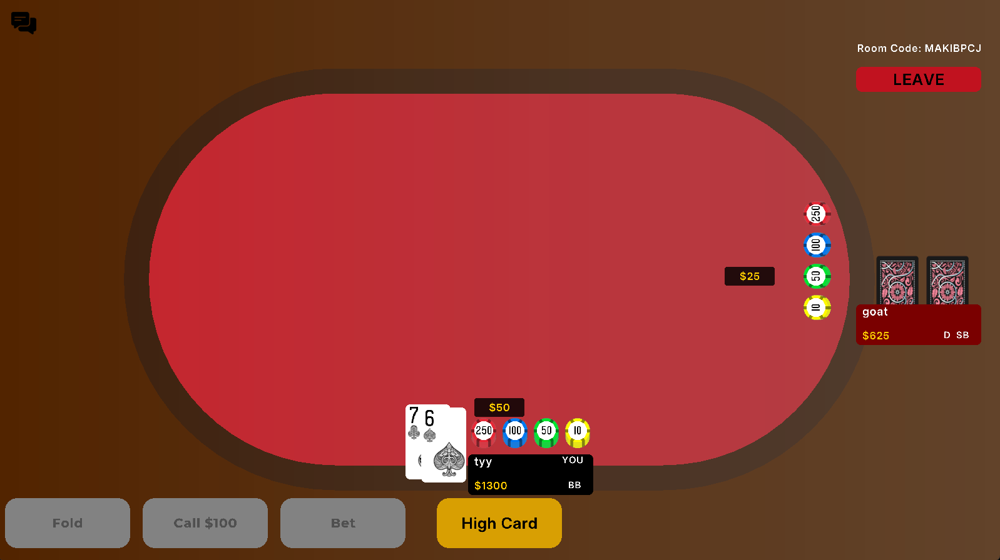
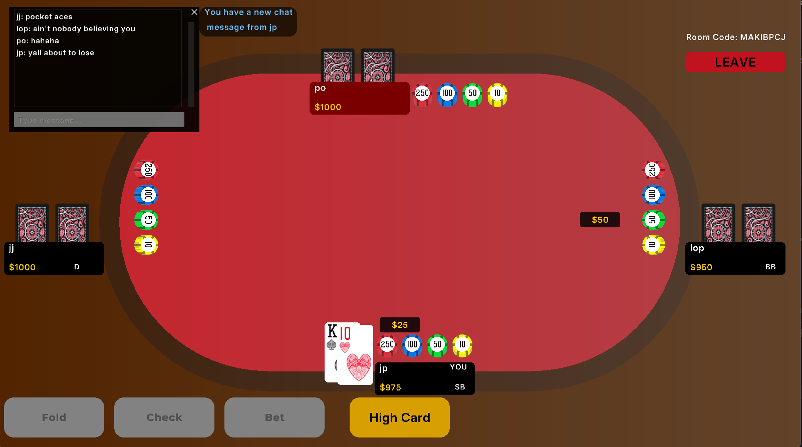
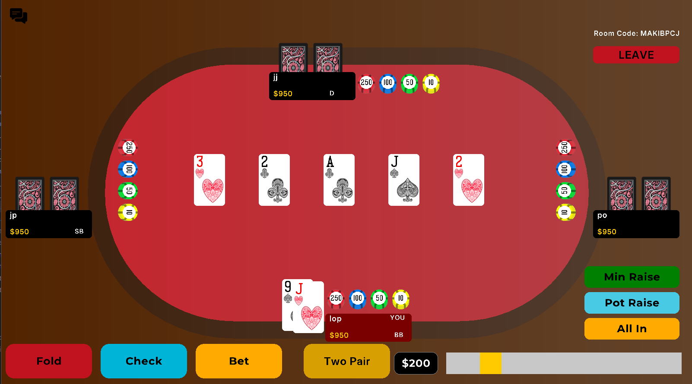

# All In Poker

All In Poker is a LAN multiplayer poker game built with C++, raylib, and Boost.Asio. It supports hosting, joining by room code, betting actions, spectators, chat, all-ins, side pots, and graphical gameplay.

## Demo

Watch the demo video:  
[All In Poker Demo](media/demo/all-in-poker-demo.mp4)

## Screenshots

### Main Menu

### Gameplay

### Chat

### Showdown

## Features

- LAN multiplayer using Boost.Asio TCP networking
- Room-code based hosting and joining
- Graphical interface built with raylib
- Poker betting actions: fold, check, call, and raise
- All-in and side-pot handling
- Spectator support
- In-game chat
- Fullscreen support

## How to Play

### How to host

1. Open the game.
2. Enter your name.
3. Click Host.
4. Give your room code to your friends.

### How to join

1. Open the game.
2. Enter your name.
3. Enter the host's room code.
4. Click Join.

## Controls

- Click the action buttons to fold, check, call, or raise.
- Press F11 or Alt + F to toggle fullscreen.
- Press the Leave button to return to the main menu.

## Known Issues

- The game only works when all players are on the same LAN/Wi-Fi.
- If something does not behave correctly, please report what happened and what you were doing when it happened.

## Technologies Used

- C++
- raylib
- Boost.Asio
- CMake
